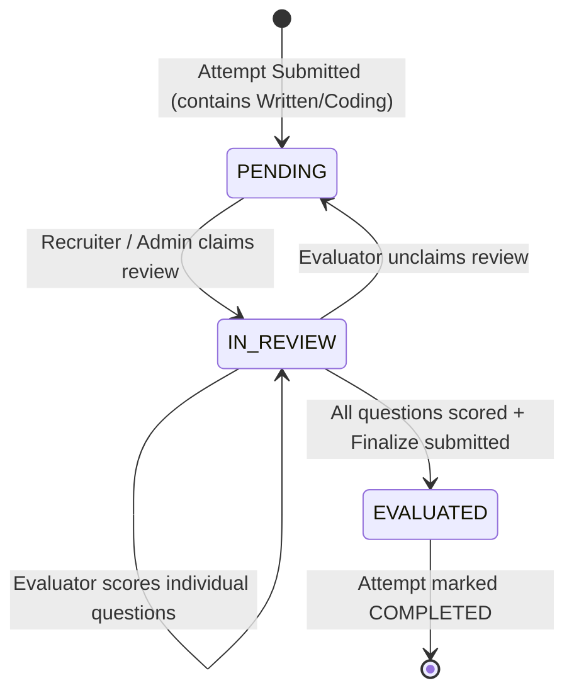
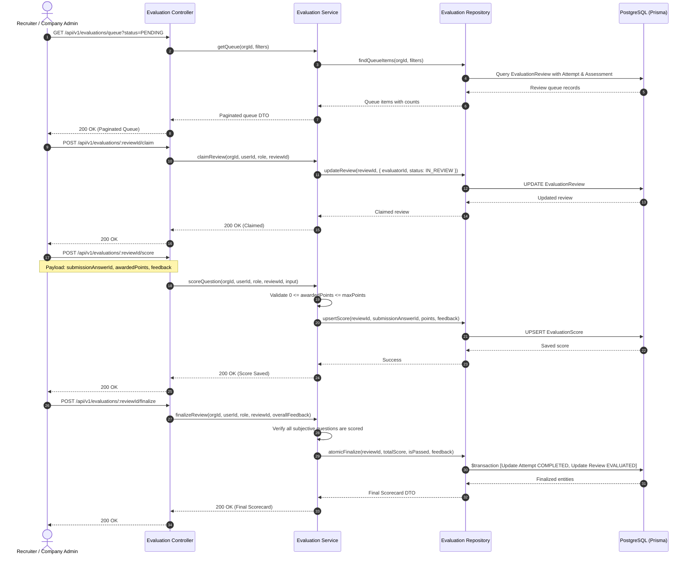

## Goal Capsule

- Objective: Implement the Evaluation Queue & Review module enabling Recruiters and Company Admins to manage human scoring for candidate submissions with subjective questions (Coding challenges and Written essays), claim reviews, evaluate answers against rubrics with itemized points and inline feedback, finalize total scores with automatic percentage/pass-fail calculation, maintain strict multi-tenant isolation, and provide code-first OpenAPI 3.1 documentation.
- Authority Hierarchy:
  1. Primary Specification (`docs/backend-requirements-and-architecture.md`)
  2. Agent Guidelines (`AGENTS.md`)
  3. This Plan (`docs/plans/evaluation-queue-module.md`)
- Execution Profile: `code`
- Stop Conditions: Stop and request feedback if changes to `prisma/schema.prisma` are required or if Better Auth organization roles conflict with tenant guards.
- Tail Ownership: Automated documentation validation (`npm run docs:validate`), TypeScript compilation (`npx tsc --noEmit`), seed execution (`npm run prisma:seed`), and E2E verification (`npm run test:evaluations`).

---

## Product Contract

### Summary
The Evaluation Queue & Review module completes the hybrid evaluation loop of the Developer Assessment Platform. Assessments containing subjective questions (`CODING` or `WRITTEN`) cannot be auto-graded by a sandbox engine; instead, they transition into an organization-scoped evaluation queue upon candidate submission. Recruiters and Company Administrators inspect candidate code and written essays, review defined grading rubrics, claim reviews to prevent concurrent collisions, award points with specific feedback per question, and finalize scores to calculate the candidate's final weighted grade, pass/fail status, and transition the attempt to `COMPLETED`.

### Problem Frame
Automated code execution (sandboxes/Judge0) introduces substantial operational attack surfaces, cost, and maintenance complexity, while failing to evaluate code structure, naming conventions, architectural trade-offs, and written technical explanations. The platform solves this through structured human review. Recruiters require a dedicated review queue that organizes pending submissions, locks claimed reviews against conflicting double-grading, exposes questions alongside their authoritative evaluation rubrics, enforces strict point limits based on assessment weights, and deterministically computes combined final scores (`autoScore + manualScore`).

### Requirements

#### Queue Listing & Filter Controls
- R1. Authorized company members (`COMPANY_ADMIN`, `RECRUITER`) can list pending, active, and completed evaluation reviews via `GET /api/v1/evaluations/queue`.
- R2. The queue listing must strictly enforce tenant isolation, returning only reviews whose associated attempt and assessment belong to the active tenant (`req.organizationId`).
- R3. The queue listing shall support pagination (`page`, `limit`), filtering by status (`PENDING`, `IN_REVIEW`, `EVALUATED`), filtering by `assessmentId`, and filtering by `evaluatorId` (including `"me"` representing the current user).
- R4. Each queue item in the response must project summary metadata:
  - `reviewId`: UUID of `EvaluationReview`
  - `attemptId`: UUID of `AssessmentAttempt`
  - `candidateName`: string or null
  - `candidateEmail`: string
  - `assessmentId`: UUID
  - `assessmentTitle`: string
  - `submittedAt`: timestamp
  - `evaluationStatus`: `PENDING` | `IN_REVIEW` | `EVALUATED`
  - `evaluator`: `{ id, name, email }` or null
  - `subjectiveQuestionsCount`: number of `WRITTEN` and `CODING` questions in the attempt
  - `gradedQuestionsCount`: number of subjective questions with an existing `EvaluationScore`
  - `autoScore`: accumulated MCQ auto-score
  - `totalPossibleScore`: assessment `totalScore`

#### Detailed Submission & Rubric Inspection
- R5. Authorized company members can retrieve complete submission and grading context via `GET /api/v1/evaluations/:reviewId`.
- R6. The inspection endpoint must verify tenant ownership (`attempt.assessment.organizationId === req.organizationId`), returning HTTP 404 if not found or unauthorized.
- R7. The response must expose all assessment questions (MCQs, Written, Coding) with:
  - Problem title, type, allocated points in this assessment, statement/description.
  - Question-specific rubrics (`evaluationRubric`) and coding parameters (`codingDetails`) for subjective questions.
  - The candidate's submitted answer (`selectedOptions` for MCQs, `writtenAnswer` for Written, `submittedCode` and `selectedLanguage` for Coding).
  - Any already-recorded `EvaluationScore` (awarded points, feedback) or MCQ auto-grade (`autoScore`, `isCorrect`).

#### Claim & Concurrency Governance
- R8. An authorized company member can claim an evaluation review via `POST /api/v1/evaluations/:reviewId/claim`.
- R9. Claiming logic:
  - If `evaluationStatus` is `PENDING`: sets `evaluatorId = req.user.id`, transitions `evaluationStatus = IN_REVIEW`.
  - If the review is already claimed by `req.user.id`: returns HTTP 200 OK (idempotent).
  - If claimed by another user:
    - If caller is `COMPANY_ADMIN`: allows overriding and reassigning `evaluatorId` to the admin.
    - If caller is `RECRUITER`: rejects with HTTP 409 Conflict (`"Review is already claimed by another reviewer"`).
  - If `evaluationStatus` is `EVALUATED`: rejects with HTTP 409 Conflict (`"Review has already been finalized"`).
- R10. Reviewers can release a claim by sending `{ unclaim: true }`:
  - Allowed only for the currently assigned evaluator or a `COMPANY_ADMIN`.
  - Resets `evaluatorId = null`, transitions `evaluationStatus = PENDING`.
  - Preserves any existing draft `EvaluationScore` records so work is not lost.

#### Question Scoring & Inline Feedback
- R11. Evaluators can score individual questions via `POST /api/v1/evaluations/:reviewId/score`.
- R12. Scoring payload requires `{ submissionAnswerId: UUID, awardedPoints: number, feedback?: string }`.
- R13. Scoring validations:
  - The review must belong to the active tenant and have status `IN_REVIEW`.
  - Only the assigned evaluator (or a `COMPANY_ADMIN`) can submit scores.
  - The `submissionAnswerId` must belong to this review's attempt.
  - The target question type must be `WRITTEN` or `CODING` (MCQ auto-scores cannot be scored via this endpoint).
  - `awardedPoints` must satisfy `0 <= awardedPoints <= maxPoints`, where `maxPoints` is the points allocated to this problem in `AssessmentProblem`.
- R14. Upserts the `EvaluationScore` record keyed on `submissionAnswerId`, updating `awardedPoints`, `maxPoints`, and `feedback`.
- R15. Automatically updates the intermediate `attempt.manualScore` as the sum of all awarded points for the attempt.

#### Review Finalization & Score Calculation
- R16. Evaluators can finalize grading via `POST /api/v1/evaluations/:reviewId/finalize` with optional `{ overallFeedback?: string }`.
- R17. Finalization guards:
  - Review must be in `IN_REVIEW` status and assigned to caller (or caller is `COMPANY_ADMIN`).
  - **Completeness Check**: Every `WRITTEN` and `CODING` submission answer in the attempt must have a recorded `EvaluationScore`. If any subjective question remains unscored, reject with HTTP 400 Bad Request listing the unscored problem IDs.
- R18. Finalization state mutations:
  - Calculates `manualScore = sum(EvaluationScore.awardedPoints)`.
  - Calculates `totalScore = attempt.autoScore + manualScore`.
  - Calculates `percentage = (totalScore / assessment.totalScore) * 100` (rounded to 2 decimal places).
  - Computes `isPassed`: if `assessment.passingScore !== null`, `totalScore >= assessment.passingScore`, else `true`.
  - Updates attempt: `status = COMPLETED`, `evaluationStatus = EVALUATED`.
  - Updates review: `evaluationStatus = EVALUATED`, `evaluatedAt = NOW()`, `overallFeedback`.
  - Returns finalized evaluation scorecard DTO.

### Scope Boundaries
- In Scope: Queue querying, review claiming/unclaiming, itemized rubric scoring, draft feedback persistence, final aggregation & state transitions, OpenAPI 3.1 contract registration, and E2E verification tests.
- Out of Scope / Deferred:
  - Code sandbox execution (expressly excluded per platform design).
  - Bulk scoring / batch grading multiple candidates in one call (future milestone).
  - Aggregated analytics / cohort score distribution (handled in Module 6: `report`).

---

## Planning Contract

### Key Technical Decisions
- KTD1. **Layered Architecture Consistency**: Build the module in `src/modules/evaluation/` adhering to the established 5-layer pattern:
  - `evaluation.schema.ts`: Zod request/response schemas, OpenAPI path registrations under `Evaluations` tag.
  - `evaluation.repository.ts`: Encapsulated Prisma operations for `EvaluationReview`, `EvaluationScore`, `AssessmentAttempt`, and queue projections.
  - `evaluation.service.ts`: Business logic, claim locking, point ceiling validation, completeness verification, score aggregation.
  - `evaluation.controller.ts`: Express controllers returning typed `createApiResponseSchema` and `createPaginatedResponseSchema`.
  - `evaluation.routes.ts`: Router mounted with `requireAuth`, `requireCompanyRole(["admin", "recruiter"])`, and `validateRequest`.
- KTD2. **Tenant Isolation via Relational Traversal**: Because `EvaluationReview` connects to `AssessmentAttempt` which connects to `Assessment`, all queries strictly filter via `attempt.assessment.organizationId = req.organizationId`.
- KTD3. **Concurrency & Review Locking**: Reviewers must claim an evaluation before scoring (`evaluationStatus: IN_REVIEW`). A claim creates an exclusive lock preventing other recruiters from grading the same candidate simultaneously, while allowing `COMPANY_ADMIN` supervisory reassignment.
- KTD4. **Point Ceiling Enforcement**: During question scoring, `maxPoints` is queried directly from `AssessmentProblem.points` associated with the attempt's assessment. `awardedPoints` is strictly validated to ensure `0 <= awardedPoints <= maxPoints`.
- KTD5. **Atomic Finalization via Prisma Transaction**: Finalizing the evaluation runs inside a `prisma.$transaction` to guarantee that score calculation, attempt status update (`COMPLETED`), and review status update (`EVALUATED`) happen atomically.
- KTD6. **Zero-Drift OpenAPI Documentation**: All 5 endpoints registered in `src/lib/openapi.ts` with comprehensive request, parameter, and response schemas.

### High-Level Technical Design

#### Evaluation Review State Machine


#### Evaluation Processing Flow


### Output Structure
```text
src/
└── modules/
    └── evaluation/
        ├── evaluation.schema.ts      # Zod validation & OpenAPI route registrations
        ├── evaluation.repository.ts  # Database queries for reviews & scores
        ├── evaluation.service.ts     # Claiming, scoring validation & finalization
        ├── evaluation.controller.ts  # Express HTTP request handlers
        └── evaluation.routes.ts      # Route mounting with auth & role guards
src/scripts/
└── test-evaluations-e2e.ts           # Comprehensive E2E verification test suite
```

---

## Implementation Units

### U1. Evaluation Validation Schemas & OpenAPI Registry
- **Goal**: Define comprehensive Zod schemas for queue querying, review inspection, claiming, question scoring, and finalization, and register all 5 endpoints in OpenAPI.
- **Requirements**: Covers R1, R3, R4, R5, R7, R8, R10, R11, R12, R16.
- **Files**:
  - `src/modules/evaluation/evaluation.schema.ts`
- **Approach**:
  - Define `EvaluationQueueQuerySchema` (`page`, `limit`, `status`, `assessmentId`, `evaluatorId`).
  - Define `EvaluationQueueItemSchema` and `EvaluationQueueResponseSchema`.
  - Define `ReviewIdParamSchema` (`reviewId: z.string().uuid()`).
  - Define `ClaimReviewBodySchema` (`{ unclaim: z.boolean().optional() }`).
  - Define `ScoreQuestionBodySchema` (`{ submissionAnswerId: UUID, awardedPoints: number, feedback?: string }`).
  - Define `FinalizeEvaluationBodySchema` (`{ overallFeedback?: string }`).
  - Define `EvaluationDetailResponseSchema` with complete problem statement, rubrics, coding parameters, candidate answers, and awarded scores.
  - Register OpenAPI paths for:
    - `GET /evaluations/queue`
    - `GET /evaluations/{reviewId}`
    - `POST /evaluations/{reviewId}/claim`
    - `POST /evaluations/{reviewId}/score`
    - `POST /evaluations/{reviewId}/finalize`
- **Patterns to follow**: Mirror `src/modules/attempt/attempt.schema.ts` and `src/modules/assessment/assessment.schema.ts`.
- **Test scenarios**:
  - Validates `awardedPoints` is non-negative.
  - Validates UUID formatting for `reviewId` and `submissionAnswerId`.
  - Verify `npm run docs:validate` succeeds and documents all 5 evaluation routes.
- **Verification**: `npm run docs:validate` passes with 86 routes.

### U2. Evaluation Repository Layer
- **Goal**: Implement encapsulated Prisma operations for querying evaluation queue, fetching review details, managing claim state, upserting question scores, and executing atomic finalization.
- **Requirements**: Covers R2, R3, R4, R6, R7, R9, R10, R14, R15, R18.
- **Files**:
  - `src/modules/evaluation/evaluation.repository.ts`
- **Approach**:
  - `findQueue(orgId, filters)`: Queries `EvaluationReview` filtering by `attempt.assessment.organizationId = orgId`, with status, assessment, and evaluator filters, including pagination. Calculates subjective question count and graded question count.
  - `findById(reviewId)`: Fetches review by ID including `attempt.assessment.problems`, `attempt.answers.problem`, `attempt.candidate`, `scores`, and `evaluator`.
  - `updateClaim(reviewId, evaluatorId, status)`: Updates `evaluatorId` and `evaluationStatus`.
  - `upsertScore(reviewId, submissionAnswerId, awardedPoints, maxPoints, feedback)`: Upserts `EvaluationScore`.
  - `updateAttemptManualScore(attemptId, manualScore)`: Updates attempt manual score.
  - `finalizeReview(reviewId, attemptId, data)`: Executes `$transaction` updating attempt to `COMPLETED` with final scores, and review to `EVALUATED`.
- **Patterns to follow**: Mirror `src/modules/attempt/attempt.repository.ts`.
- **Test scenarios**:
  - Queue query correctly filters by organization ID and returns zero items for mismatched tenants.
  - Upserting an existing question score replaces the score without duplicating records.
- **Verification**: Integration test queries execute without Prisma runtime errors.

### U3. Evaluation Service Layer
- **Goal**: Implement business logic for queue filtering, claim governance with role permissions, rubric point validation, completeness verification, and score aggregation.
- **Requirements**: Covers R2, R6, R9, R10, R13, R14, R15, R17, R18.
- **Files**:
  - `src/modules/evaluation/evaluation.service.ts`
- **Approach**:
  - Implement `getQueue(orgId, query)`.
  - Implement `getReviewDetail(orgId, reviewId)`: Enforces tenant isolation. Formats detailed question list combining problem definitions, rubrics, candidate answers, and score status.
  - Implement `claimReview(orgId, userId, role, reviewId, unclaim)`:
    - Verifies review exists and belongs to tenant.
    - Handles claim vs unclaim.
    - Enforces role permissions (Admins can override claims; Recruiters cannot steal other recruiters' claims).
  - Implement `scoreQuestion(orgId, userId, role, reviewId, input)`:
    - Verifies review is `IN_REVIEW`.
    - Verifies caller is assigned evaluator or Admin.
    - Validates problem type is `WRITTEN` or `CODING`.
    - Looks up `AssessmentProblem.points` to ensure `0 <= awardedPoints <= maxPoints`.
    - Upserts score and updates intermediate `attempt.manualScore`.
  - Implement `finalizeEvaluation(orgId, userId, role, reviewId, input)`:
    - Verifies review is `IN_REVIEW` and assigned to caller/admin.
    - Checks that all `WRITTEN` and `CODING` answers have an `EvaluationScore`. Throws 400 Bad Request if incomplete.
    - Calculates total score, percentage, and pass/fail.
    - Commits atomic transaction and returns finalized scorecard.
- **Patterns to follow**: Mirror `src/modules/attempt/attempt.service.ts`.
- **Test scenarios**:
  - Attempting to claim another reviewer's review as a recruiter throws 409 Conflict.
  - Attempting to award 15 points on a 10-point question throws 400 Bad Request.
  - Finalizing with unscored subjective questions throws 400 Bad Request.
  - Finalizing computes `totalScore = autoScore + manualScore` accurately.
- **Verification**: Comprehensive unit and business rule checks.

### U4. Evaluation Controller & Route Mounting
- **Goal**: Implement Express request handlers and mount routes with Better Auth guards and request validation.
- **Requirements**: Covers R1, R5, R8, R11, R16.
- **Files**:
  - `src/modules/evaluation/evaluation.controller.ts`
  - `src/modules/evaluation/evaluation.routes.ts`
  - `src/routes/index.ts`
- **Approach**:
  - Build `evaluation.controller.ts` with handlers for `getQueue`, `getReviewDetail`, `claimReview`, `scoreQuestion`, and `finalizeEvaluation`.
  - Build `evaluation.routes.ts` protecting all routes with `requireAuth` and `requireCompanyRole(["admin", "recruiter"])`.
  - Mount `/evaluations` router in `src/routes/index.ts` by uncommenting `apiV1Router.use("/evaluations", evaluationRouter);`.
- **Patterns to follow**: Mirror `src/modules/assessment/assessment.routes.ts`.
- **Test scenarios**:
  - Unauthenticated requests return 401 Unauthorized.
  - Candidates (users without company role) return 403 Forbidden.
  - Valid requests return standard `ApiResponse` or `ApiPaginatedResponse`.
- **Verification**: `npx tsc --noEmit` and route invocation checks.

### U5. End-to-End Verification Test Script & Package Script
- **Goal**: Build automated verification script testing the entire evaluation lifecycle from queue listing to finalization.
- **Requirements**: Covers R1 through R18.
- **Files**:
  - `src/scripts/test-evaluations-e2e.ts`
  - `package.json`
- **Approach**:
  - Test flow:
    1. Authenticate as Recruiter (`recruiter@techcorp.dev`).
    2. Authenticate as Candidate (`bob@candidate.dev`).
    3. Unauthenticated access to `/api/v1/evaluations/queue` (expect 401).
    4. Candidate access to `/api/v1/evaluations/queue` (expect 403).
    5. Recruiter lists queue (`GET /evaluations/queue`), verifies Bob's `UNDER_REVIEW` attempt is listed with `PENDING` status.
    6. Recruiter inspects review details (`GET /evaluations/:reviewId`), verifies coding problem statement, candidate code, and rubric are returned.
    7. Recruiter claims review (`POST /evaluations/:reviewId/claim`), verifies status transitions to `IN_REVIEW`.
    8. Attempt to finalize before scoring questions (expect 400 Bad Request).
    9. Attempt to award points exceeding max points (expect 400 Bad Request).
    10. Recruiter scores the coding question (`POST /evaluations/:reviewId/score`) with valid points and feedback.
    11. Recruiter finalizes evaluation (`POST /evaluations/:reviewId/finalize`), verifies status transitions to `COMPLETED` / `EVALUATED`, total score and percentage are computed accurately.
    12. Verify attempt status is now `COMPLETED` and subsequent scoring attempts return 409 Conflict.
- **Test Scenarios**: Covers 12 distinct assertions against live server.
- **Verification**: `npm run test:evaluations` exits with 0.

---

## Verification Contract

### Automated Verification Commands
```bash
# 1. Validate OpenAPI 3.1 documentation generation
npm run docs:validate

# 2. Verify TypeScript static compilation
npx tsc --noEmit

# 3. Verify idempotent database seeding
npm run prisma:seed

# 4. Run Evaluation Queue E2E verification test suite
npm run test:evaluations
```

---

## Definition of Done
1. All 5 endpoints (`/queue`, `/:reviewId`, `/:reviewId/claim`, `/:reviewId/score`, `/:reviewId/finalize`) are fully implemented and return typed response envelopes.
2. Tenant isolation is strictly enforced across all operations.
3. Review claim locking prevents double-grading while permitting admin overrides.
4. Score validation strictly enforces point ceilings against `AssessmentProblem.points`.
5. Review finalization validates question completeness, calculates final scores atomically, and transitions attempt to `COMPLETED`.
6. 100% of endpoints are documented in OpenAPI 3.1 via `@asteasolutions/zod-to-openapi`.
7. `npm run docs:validate`, `npx tsc --noEmit`, and `npm run test:evaluations` pass with zero errors.

